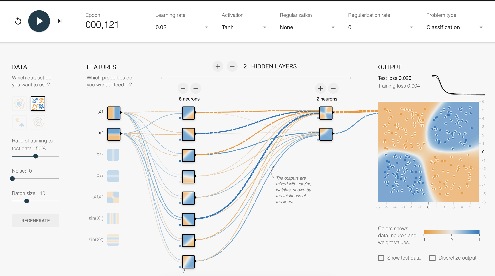

```{r}
library(here)
library(arrow)
library(tidyverse)
library(patchwork)

conflicted::conflicts_prefer(dplyr::filter)

knitr::opts_chunk$set(
  fig.width = 6,
  fig.height = 4,
  fig.align = "center",
  out.width = "100%",
  code.line.numbers = FALSE,
  fig.retina = 4,
  echo = TRUE,
  message = FALSE,
  warning = FALSE,
  cache = FALSE,
  dev.args = list(pointsize = 11)
)

options(
  digits = 2,
  width = 60,
  ggplot2.discrete.fill = c("#E57F12", "#38535E"),
  ggplot2.discrete.colour = c("#E57F12", "#38535E")
)

theme_set(
  theme_bw(base_size = 14) +
    theme(
      aspect.ratio = 1,
      plot.background = element_rect(fill = 'transparent', colour = NA),
      plot.title.position = "plot",
      plot.title = element_text(size = 24),
      panel.background = element_rect(fill = 'transparent', colour = NA),
      legend.background = element_rect(fill = 'transparent', colour = NA),
      legend.key = element_rect(fill = 'transparent', colour = NA)
    )
)

plot_nn_fit <- function(combined, f1_score) {
  data_obj <- arrow::read_parquet(glue::glue(
    "fits/{combined}_fit.parquet.lz4"
  ))
  ggplot(data_obj, aes(x = x, y = y, color = factor(preds))) +
    geom_point(show.legend = F) +
    geom_line(
      data = original_bound,
      aes(x = x, y = y),
      linewidth = 1,
      alpha = 0.5,
      color = "white",
      inherit.aes = FALSE
    ) +
    coord_equal() +
    theme_void() +
    labs(
      title = paste(
        (str_split(combined, "_") |> unlist())[1],
        " neurons"
      )
    )
}

process_metrics <- function(metrics) {
  metrics |>
    bind_rows() |>
    mutate(row_id = row_number()) |>
    pivot_longer(c(f1, acc), names_to = "metric", values_to = "val")
}

rank_metrics <- function() {
  metric_files <- list.files(
    here("metrics"),
    pattern = "*.lz4",
    full.names = TRUE
  )
  metrics <- lapply(metric_files, arrow::read_parquet) |>
    process_metrics()

  metrics |>
    filter(metric == "f1") |>
    group_by(neuron) |>
    arrange(val) |>
    mutate(ranked = row_number()) |>
    ungroup()
}


get_ranked_seed <- function(ranked, neurons, rank_val = 1) {
  x <- ranked |>
    filter(neuron == neurons, ranked == rank_val) |>
    unite(name, neuron, seed, epoch)

  return(list(combined = x$name, val = x$val))
}

ranked <- rank_metrics()
width <- 1080
height <- 1080
```

## A little bit about me

- This is the story of how I as a PhD student struggled for an entire year because I didn't win the lottery.

{width=50%}

- I work on explaining AI models.
- And as someone working on explaining AI models, first I need to make an AI model.

## Fitting a neural network

- It's hard, right? We'd like to hit an easy button to get a model?
- We care only about the performance of the model and the modeling pipeline.
- We do not care about the size or complexity of the models.
- _If it predicts well all is ok, right?_


# Quick refresher

[Playground](https://playground.tensorflow.org/)




## QUESTIONS for you

:::: {.columns}
::: {.column width=50%}

:::{.panel-tabset}

## Q1

What is the role of a node in the hidden layer?

- makes a linear cut
- fits one part of the data
- removes noise
- defines a logistic function
- activates the net

## Q2

Do you think the random seed used will affect a fit?

- yes
- no
- maybe

## Q3

Will more neurons always result in a better fit?

- yes
- no
- maybe

:::
:::

::: {.column .fragment fragment-index=2 width=50%}

{style="width: 6rem; margin: 0 auto; text-align: center; display: block"}

Join the online poll at [menti.com](menti.com) with code `4398 8771` 

<div style='position: relative; padding-bottom: 56.25%; padding-top: 35px; height: 0; overflow: hidden;'><iframe sandbox='allow-popups allow-scripts allow-same-origin allow-presentation' allowfullscreen='true' allowtransparency='true' frameborder='0' height='315' src='https://www.mentimeter.com/app/presentation/alj3m1u8cudogusi4chsr1wbt1jfj6o8/embed' style='position: absolute; top: 0; left: 0; width: 100%; height: 100%;' width='420'></iframe></div>

:::
::::

## Let's work on fitting this dataset 

:::: {.columns}
::: {.column width=60%}

```{r}
#| echo: false
#| fig-width: 4
#| fig-height: 5
#| out-width: 100%
dataset <- arrow::read_parquet(
  "train_df.parquet.lz4"
)

original_bound <- jsonlite::fromJSON(
  "[[-10,-10],[-8.875,-3.75],[-4.21875,-3.75],[-0.3125,1.25],[5,-5],[10,10]]"
) |>
  as.data.frame() |>
  setNames(c("x", "y"))

p <- ggplot(dataset, aes(x = x, y = y, color = factor(class))) +
  geom_point(size = 0.5) +
  geom_line(
    data = original_bound,
    aes(x = x, y = y),
    linewidth = 2,
    alpha = 0.5,
    color = "white",
    inherit.aes = FALSE
  ) +
  coord_equal() +
  theme_minimal() +
  labs(color = "Class", x = "x", y = "y") +
  theme(legend.position = "bottom", axis.text = element_blank())
p
```

:::
::: {.column width=30%}

<br><br>
This has two predictors, `x`, `y` and 

one response, `Class`, a categorical variable with two levels. 

:::
::::

## Neural network size? {.smaller}

::::{.columns}
:::{.column width=50%}

:::{.panel-tabset}

## Hyperparameters

**These hyperparameters are fixed for now**

- Number of epochs: 100
- Batch size: 71
- Loss function: Binary Cross Entropy loss
- Optimizer: Adam
- Training set size: 5,000
- Testing set size: 5,000

## Question

**How many neurons are needed in the hidden layer?**

```{r}
#| echo: false
#| fig-width: 4
#| fig-height: 5
#| out-width: 70%
p
```
:::

:::
:::{.column .fragment fragment-index=2 width=50%}

**How many neurons?**

{style="width: 6rem; margin: 0 auto; text-align: center; display: block"}

Join the online poll at [menti.com](menti.com) with code `4398 8771` 

<div style='position: relative; padding-bottom: 56.25%; padding-top: 35px; height: 0; overflow: hidden;'><iframe sandbox='allow-popups allow-scripts allow-same-origin allow-presentation' allowfullscreen='true' allowtransparency='true' frameborder='0' height='315' src='https://www.mentimeter.com/app/presentation/alj3m1u8cudogusi4chsr1wbt1jfj6o8/embed' style='position: absolute; top: 0; left: 0; width: 100%; height: 100%;' width='420'></iframe></div>
:::
::::

## So here are some fits

```{r}
#| echo: false
#| fig-label: nn_fit_holder

a <- list(
  four = get_ranked_seed(ranked, 4),
  eight = get_ranked_seed(ranked, 8),
  five = get_ranked_seed(ranked, 5),
  ten = get_ranked_seed(ranked, 10),
  twenty = get_ranked_seed(ranked, 20),
  thirty = get_ranked_seed(ranked, 30)
)
plot_nn_fit(a$four$combined, a$four$val) +
  plot_nn_fit(a$eight$combined, a$eight$val) +
  plot_nn_fit(a$five$combined, a$five$val) +
  plot_nn_fit(a$ten$combined, a$ten$val) +
  plot_nn_fit(a$twenty$combined, a$twenty$val) +
  plot_nn_fit(a$thirty$combined, a$thirty$val)
```


## Let's try some different sizes

- We will fit two models: 5, 30 neurons
- We will also re-fit multiple times

## What have we learned?

- The larger neural network has more stable fits

- The smaller neural network is as accurate as the larger one
    - sometimes
    - but has a lot of variability in the model fit (depending on the initial random seed)

## Your turn


1. Go to this app

[random-nn-playground.janithwanni.com](random-nn-playground.janithwanni.com)

2. Play with setting the number of neurons and re-fitting multiple times. 

:::{.callout-note title="Pay attention to model size"}

Think about how the fitted model looks with the different choices.

:::


:::{.fragment}

:::{.callout-caution title="Start running"}

You've got 15 minutes
:::

:::


## QUESTIONS for you

:::: {.columns}
::: {.column width=50%}

:::{.panel-tabset}

## Q1

What is the role of a node in the hidden layer?

- makes a linear cut
- fits one part of the data
- removes noise
- defines a logistic function
- activates the net

## Q2

Do you think the random seed used will affect a fit?

- yes
- no
- maybe

## Q3

Will more neurons always result in a better fit?

- yes
- no
- maybe

:::
:::

::: {.column .fragment fragment-index=2 width=50%}

{style="width: 6rem; margin: 0 auto; text-align: center; display: block"}

Join the online poll at [menti.com](menti.com) with code `4398 8771` 

<div style='position: relative; padding-bottom: 56.25%; padding-top: 35px; height: 0; overflow: hidden;'><iframe sandbox='allow-popups allow-scripts allow-same-origin allow-presentation' allowfullscreen='true' allowtransparency='true' frameborder='0' height='315' src='https://www.mentimeter.com/app/presentation/alj3m1u8cudogusi4chsr1wbt1jfj6o8/embed' style='position: absolute; top: 0; left: 0; width: 100%; height: 100%;' width='420'></iframe></div>

:::
::::

## Wrapping up

- Be curious 
- Care about the little things 
- Ask why and how things work, or do something different from what we expect
- The big black boxes of neural networks are not so dark with little glimmers of light


