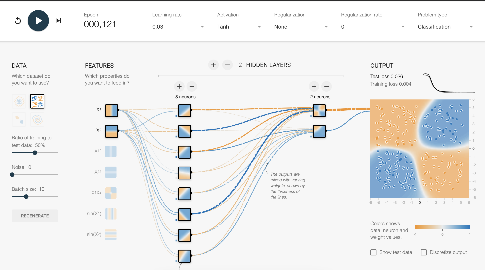
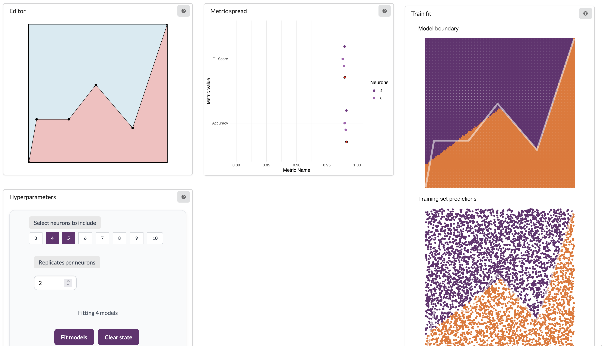

```{r}
library(here)
library(arrow)
library(tidyverse)
library(patchwork)

conflicted::conflicts_prefer(dplyr::filter)

knitr::opts_chunk$set(
  fig.width = 6,
  fig.height = 4,
  fig.align = "center",
  out.width = "100%",
  code.line.numbers = FALSE,
  fig.retina = 4,
  echo = TRUE,
  message = FALSE,
  warning = FALSE,
  cache = FALSE,
  dev.args = list(pointsize = 11)
)

options(
  digits = 2,
  width = 60,
  ggplot2.discrete.fill = c("#E57F12", "#38535E"),
  ggplot2.discrete.colour = c("#E57F12", "#38535E")
)

theme_set(
  theme_bw(base_size = 14) +
    theme(
      aspect.ratio = 1,
      plot.background = element_rect(fill = 'transparent', colour = NA),
      plot.title.position = "plot",
      plot.title = element_text(size = 24),
      panel.background = element_rect(fill = 'transparent', colour = NA),
      legend.background = element_rect(fill = 'transparent', colour = NA),
      legend.key = element_rect(fill = 'transparent', colour = NA)
    )
)

width <- 1080
height <- 1080
```

## Before we start {.smaller}

:::: {.columns}
::: {.column width=60%}

* You'll be asked a few questions 
* By responding, you agree to allow us to use your data.
* Your answers
  - are anonymous.
  - cannot be individually idenitified.
  - and only summary statistics are stored.
  - are not marked and **will not affect your grade.**
* **You can choose not to respond to any question.**
* You will be able to use a web app during the session which does not collect any data.
  
<!-- During the workshop, you’ll be asked a few questions to help explore the ideas we’re covering. By providing a response, you are agreeing to allow us to use your data. **You can choose not to respond to any question**. Your answers are anonymous, cannot be individually identified, and only summary statistics are stored. Nothing will be marked or affect your grade. You will be able to use a web app during the session which does not collect any data.  -->

:::
::: {.column width=40%}

Participating in these activities can *help you build your understanding*, and providing your responses will help us *improve how we teach this topic*.

You can learn more details about the project at [https://bit.ly/4btsNrR](https://bit.ly/4btsNrR).

:::
::::

:::{.fragment .center}

<br/>

### Now back to the show 

:::

## A little bit about me {.center}

:::{.incremental}
- Hi 👋🏽 I'm Janith, a final year PhD student. 
- My work centers around making tools that explain AI models more accessible
- And as someone working on explaining AI models, I tend to fit a lot of neural networks.
- Let's get a refresher on how neural networks work!
:::

## Quick refresher

[Playground](https://playground.tensorflow.org/)



::: {.notes}
Things that we will need to discuss about the playground should come here.
There are four parts to this UI
the top bar has the play button to start the fitting, next to it we see how many epochs or training rounds the fitting has gone for, 
Next to it we have a set of hyper parameters like the learning rate, the activation etc. but we are not going to touch on that today

The left most panel contains the datasets that we can use for this demonstration, we will use this one for ease of understanding

The middle panel shows the layers and the flow of data in the model. We can add up to 8 neurons in a hidden layer. For this demonstration I will use four neurons. We can add more layers if needed but for simplicity in this case let's use one hidden layer. and then on the right hand we have the fit of the model on the entire xy plane. we get to see the training and testing loss and we get to see the testing dataset on the plane as well.

We can start fitting a model by pressing the play button and after we are happy with the result we can add or remove more neurons, we can restart the training etc. Give it a try and see how it feels for 3 minutes. 
:::

## Fitting a neural network

- It looks easy, right? We'd like to hit an easy button to get a model!
- Most of the time, we care only about the performance of the model and the modeling pipeline.
- Given the computational power we have, we rarely care about the size or complexity of the models.
- _If it predicts well all is ok, right?_


## Let's have a check-in 


:::{.panel-tabset}

## Q1

Which of the following best describes the role of a single neuron in a hidden layer?

- Creates a flexible curve that wraps around specific data points. 
- Acts as a filter that removes noise from the dataset.
- Defines a linear hyperplane (a "cut") that partitions the input space.
- Maps each individual input point to its own unique output coordinate.

## Q2

Do you think the random seed used will affect the model's performance on the training set?

- Yes
- No
- Maybe?

## Q3

Will more neurons result in better performance in the training and testing set?

- Yes
- No
- Maybe

:::

# Fitting our own neural network

## Let's work on fitting this dataset 

:::: {.columns}
::: {.column width=60%}

```{r}
#| echo: false
#| fig-width: 4
#| fig-height: 5
#| out-width: 100%
dataset <- arrow::read_parquet(
  "train_df.parquet.lz4"
)

original_bound <- jsonlite::fromJSON(
  "[[-10,-10],[-8.875,-3.75],[-4.21875,-3.75],[-0.3125,1.25],[5,-5],[10,10]]"
) |>
  as.data.frame() |>
  setNames(c("x", "y"))

p <- ggplot(dataset, aes(x = x, y = y, color = factor(class))) +
  geom_point(size = 0.5) +
  geom_line(
    data = original_bound,
    aes(x = x, y = y),
    linewidth = 2,
    alpha = 0.5,
    color = "white",
    inherit.aes = FALSE
  ) +
  coord_equal() +
  theme_minimal() +
  labs(color = "Class", x = "x", y = "y") +
  theme(legend.position = "bottom", axis.text = element_blank())
p
```

:::
::: {.column width=30%}

<br><br>
This has two predictors, `x`, `y` and 

one response, `Class`, a categorical variable with two levels. 

:::
::::

## Number of neurons? {.smaller}

:::{.panel-tabset}

## Hyperparameters

**These hyperparameters are fixed for now**

- Number of epochs: 100
- Batch size: 71
- Loss function: Binary Cross Entropy loss
- Optimizer: Adam
- Training set size: 5,000
- Testing set size: 5,000

## Question

**How many neurons are needed in the hidden layer for a neural network with a single hidden layer?**

```{r}
#| echo: false
#| fig-width: 4
#| fig-height: 5
#| out-width: 50%
p
```
:::

Here we need to approach how we go from asking about the number of neurons and then test it out.

## Let's try out these sizes {.smaller}


#### For that we will use a special tool to rerun these fits multiple times

We will first try out with 5, 8 and 16

{width=25%}


## Your turn


1. Go to this app

[random-nn-playground.janithwanni.com](https://random-nn-playground.janithwanni.com)

2. Play with setting the number of neurons and re-fitting multiple times. 

:::{.callout-note title="Pay attention to model size"}

Think about how the fitted model looks with the different choices.

:::


:::{.fragment}

:::{.callout-caution title="Start running"}

You've got 10 minutes
:::

:::

## Let's have a check-in 

:::{.panel-tabset}

## Q1

Which of the following best describes the role of a single neuron in a hidden layer?

- Creates a flexible curve that wraps around specific data points. 
- Acts as a filter that removes noise from the dataset before processing. 
- Defines a linear hyperplane (a "cut") that partitions the input space.
- Maps each individual input point to its own unique output coordinate.

## Q2

Do you think the random seed used will affect the model's performance on the training set?

- Yes
- No
- Maybe

## Q3

Will more neurons result in better performance in the training and testing set?

- Yes
- No
- Maybe

## Q4

What is the most important thing you learned from this session?

## Q5

The following questions can be answered on a 5-point scale, with 5 indicating really good and 1 being really poor

- The application worked smoothly
- I enjoyed trying out different model fits by varying the seed to see change in the result
- I would recommend this application to other students to help them understand the model fitting 

:::

## What have we learned? {.smaller}

:::{.incremental}
- The role of a neuron in a neural network is to define a linear hyperplane (a "cut") that partitions the input space.
- More neurons do not always result in better performance in training and testing set
- The random seed has an effect on a model's performance
- Larger neural networks tend to have more consistent performance on multiple metrics.
- Smaller neural networks can be as performant as the larger one
    - but they tend to vary (depending on the initial random seed)
- Always fit your neural networks with differing seeds to see what the effect is on the model.
:::

:::{.fragemnt}
On a separate note,

- Ask why and how things work, or do something different from what we expect
- The big black boxes of neural networks are not so dark with little glimmers of light

:::

## Thank you! {.center}

Have any suggestions or ideas? 

{style="display:none"}

```{=html}
<div class = "card-container">
  <div class="card">
    <div class="card-text">
      <div class="portada">
        
        <span style="font-size: 0.7rem; font-style: italic;"> The colour palette for these slides are inspired by the photograph by Bill Henson as part of the art installation Oneiroi in the Hellenic Museum, Melbourne. </span>
      </div>
      <div class="title-total"> 
        <div class = "img-container">
          <div class = "img-avatar">
            
          </div>
        </div>
        <h4 class="accent-color">Janith Wanniarachchi</h4>
        <div class="desc">
          <div>
            <span> <i class="fa-regular fa-envelope fa-sm"></i> </span> 
            <span class = "contact-detail"> janith.wanniarachchi@monash.edu </span>
          </div>
          <div>
            <span> <i class="fa-brands fa-github-alt fa-sm"></i> </span>
            <span class = "contact-detail"> @janithwanni </span>
          </div>
          <div>
            <span> <i class="fa-brands fa-bluesky fa-sm"></i> </span>
            <span class = "contact-detail"> @janithwanni.bsky.social </span>
          </div>
          <div>
            <span> <i class = "fa-brands fa-linkedin"></i></span>
            <span class = "contact-detail"> janith-wanniarachchi </span>
          </div>
          <div>
            <span> <i class = "fa-solid fa-globe fa-sm"></i> </span>
            <span class = "contact-detail"> janithwanni.com </span>
          </div>
          <!-- <div>
            <span> <i class="fa-solid fa-brain fa-sm"></i> </span>
            <span class = "contact-detail"> hear.janithwanni.com </span>
          </div> -->
        </div>
      </div>
    </div>
  </div>
</div>
```

